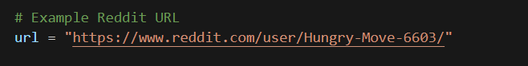
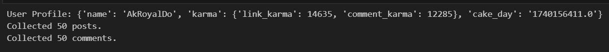
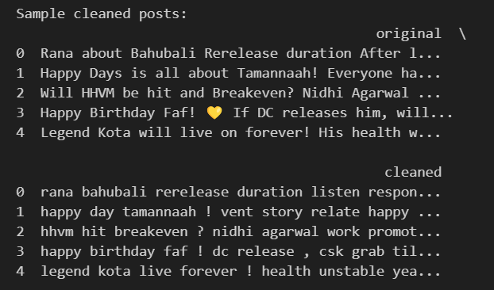
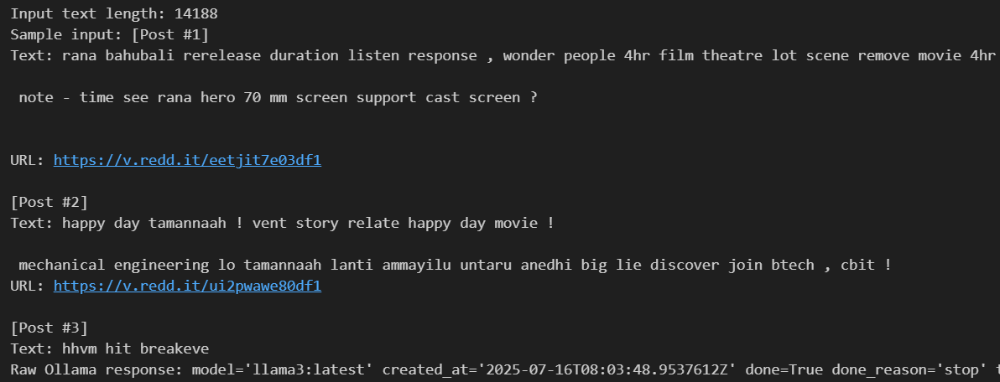
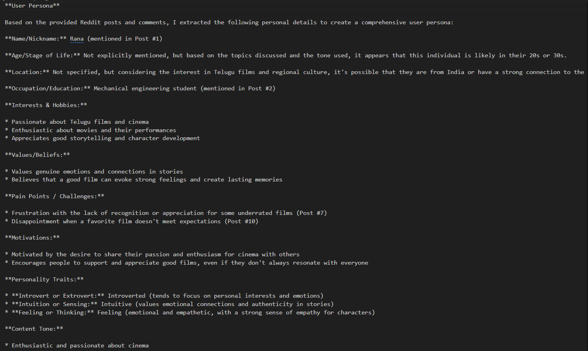

# Reddit User Persona Extractor

## Project Overview

This project extracts comprehensive **user personas** from Reddit profiles using AI,LLM and NLP.\
Given a Reddit user's profile URL, the pipeline:

1. **Collects posts and comments** via Reddit API.
2. **Cleans the text** to prepare it for analysis.
3. **Extracts personality traits, hobbies, motivations, and other persona attributes** using an **LLM (Llama3 via Ollama)**.
4. **Generates a text-based user persona** stored in the `output_txt_file/` folder.


---

## Project Pipeline: Step-by-Step

| **Step** | **Task**                      | **Tool/Method**                                      |
| -------- | ----------------------------- | ---------------------------------------------------- |
| **1**    | Input Reddit URL              | Manual or via script                                 |
| **2**    | Extract username              | `helpers.py`                                         |
| **3**    | Fetch posts & comments        | `fetch_user_data.py` using `PRAW`                    |
| **4**    | Text cleaning & preprocessing | `text_cleaning.py` with `spaCy` & `nltk`             |
| **5**    | Persona extraction (LLM)      | `llm_persona_extractor.py` using `Ollama` + `Llama3` |
| **6**    | Save persona output           | `output_txt_file/{username}_persona.txt`             |

---

## Directory Structure

```
Byondchatss/
│
├── main.ipynb               # Main notebook to run the pipeline end-to-end
├── src/
│   ├── util/
│   │   ├── llm_persona_extractor.py   # LLM persona extraction logic using Llama3 via Ollama
│   │   ├── text_cleaning.py           # Text cleaner using regex, spaCy, and NLTK
│   │   └── helpers.py                 # Helper to extract Reddit usernames from URLs
│   └── reddit_scraper/
│       └── fetch_user_data.py         # Reddit scraper using PRAW (posts, comments, profile info)
│
├── output_txt_file/         # Folder to store output persona text files (one per user)
├── output/                  # (Optional) Use this for visual persona images/cards if generated
```

---

## Detailed Role of Each File

| **File**                       | **Role**                                                                                                                                                                                                                                                |
| ------------------------------ | ------------------------------------------------------------------------------------------------------------------------------------------------------------------------------------------------------------------------------------------------------- |
| **main.ipynb**                 | The main notebook to execute the full pipeline: input URL → extract persona                                                                                                                                                                             |
| **helpers.py**                 | Contains `extract_username_from_url()` to parse Reddit profile URLs                                                                                                                                                                                     |
| **fetch\_user\_data.py**       | Uses `PRAW` to collect Reddit data: profile info, posts, comments                                                                                                                                                                                       |
| **text\_cleaning.py**          | Preprocesses raw text: cleans URLs, lemmatizes, removes stopwords                                                                                                                                                                                       |
| **llm\_persona\_extractor.py** | Core file for persona extraction using Llama3 via Ollama: - Passes cleaned text + profile data to LLM - Extracts persona fields like age, location, values - Handles citations (post references & URLs) - Saves the final persona to `output_txt_file/` |

---

## Project Setup

### Requirements

- Python 3.9+
- Conda environment recommended
- Reddit API credentials (client ID, secret, user agent)
- Ollama installed (for Llama3 model inference)

---

### Install Dependencies

```bash
conda create -n persona_env python=3.9
conda activate persona_env

pip install praw nltk spacy ollama
python -m spacy download en_core_web_sm
```

---

## Execution Guide

### =1⃣ Run the Pipeline

In `main.ipynb`:

```python
from util.llm_persona_extractor import extract_persona_llm
```

Steps:

- Provide the Reddit user URL.



- Run username extraction → `helpers.py`
- Fetch posts & comments → `fetch_user_data.py`



- Clean text → `text_cleaning.py`



- Generate persona → `llm_persona_extractor.py`




- Output saved in `output_txt_file/{username}_persona.txt`

---

### =2⃣ Output Files

```
output_txt_file/
├── Hungry-Move-6603.txt
├── ToYouItReaches_persona.txt
├── kojied.txt
```

---

## Generated Persona Example

Each `.txt` file includes:

- **Name/Nickname**
- **Age/Stage of Life**
- **Location**
- **Occupation/Education**
- **Interests & Hobbies**
- **Values/Beliefs**
- **Pain Points / Challenges**
- **Motivations**
- **Personality Traits (MBTI style)**
- **Content Tone**
- **Citations** (Post # and URL)


---

## License

MIT License\
Feel free to modify, extend, or integrate into your own analytics pipelines.

